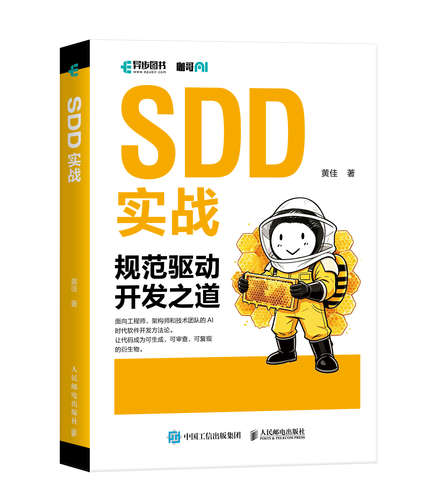
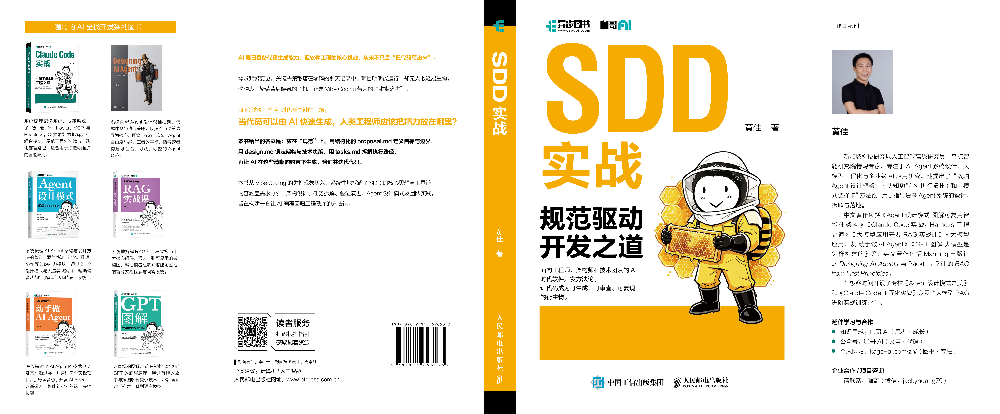

# SDD in Action

> **规范是第一手工件,代码是规范的衍生物。**
> ——《SDD 实战:规范驱动开发之道》

---

## 📕 新书:《SDD 实战:规范驱动开发之道》

<p align="center">
  
</p>

### 全书 10 章 3 阶段

| 阶段 | 章节 | 主题 |
|:--|:--|:--|
| **认识问题** | Ch1 空中楼阁 | Vibe Coding 的五个致命陷阱 |
| | Ch2 按图索骥 | SDD 核心思想 · 三次复兴 · 5 原则 · 6 阶段工作流 |
| **掌握方法** | Ch3 欲善其事 | 工具链全景:OpenSpec / Spec-Kit / BMAD / Kiro |
| | Ch4 条分缕析 | `proposal.md` 需求规范实战 |
| | Ch5 运筹帷幄 | `design.md` 架构设计 + ADR |
| | Ch6 化整为零 | `tasks.md` 任务拆解 + 执行编排 |
| | Ch7 千锤百炼 | Brownfield 老项目渐进引入 |
| **深入应用** | Ch8 登堂入室 | SDD × 5 种 Agent 设计模式 |
| | Ch9 众人拾柴 | 个人 → 团队 → 组织三阶段落地 |
| | Ch10 大道至简 | SDD 的边界与 敏捷/DevOps/TDD 融合 |

### 关于作者 · 黄佳(咖哥)

新加坡科技研究局(A*STAR)资深 AI 研究员。畅销技术书作者。代表作三部曲,从基础理论到工程落地一脉相承:

- 《**GPT 图解:大模型是怎样构建的**》——国内 LLM 入门书口碑长青
- 《**大模型应用开发:动手做 AI Agent**》——Agent 工程化中文圈启蒙读物
- 《**Designing AI Agents**》——Manning 全球英文书,国际话语权之作

《SDD 实战》是他从 Agent 设计模式延伸出的**工程方法论新作**——讲完 Agent 怎么设计,接着讲怎么把它工程化地交付出来。

<p align="center">
  
</p>

### 📚 图书信息

- **书名**:《SDD 实战:规范驱动开发之道》
- **作者**:黄佳(咖哥)
- **出版社**:人民邮电出版社 · 异步图书
- **页数**:224 页 / 7.125 印张
- **京东**:即将上架
- **当当**:即将上架
- **豆瓣**:即将上架

---

## 🧩 仓库结构

```
sdd-in-action/
├── book-code/              ← 《SDD 实战》官方配套代码 (本书章节锚定)
│   ├── README.md           ← 章节 → 文件对照
│   ├── specs/              ← proposal.md / design.md / tasks.md / contracts / adrs
│   └── examples/           ← 各章独立练习 (Ch1 / Ch3 / ...)
├── book-code-snippets.zip  ← 配套代码打包下载 (一键 zip)
├── week1/                  ← 行动营 W1 · SDD 基础 + grill-me 三件套
├── week2/                  ← 行动营 W2 · OpenSpec 登场
├── week3/                  ← 行动营 W3 · BMAD 多角色
├── week4/                  ← 行动营 W4 · Superpowers 完整方法论
└── assets/                 ← 封面图等媒体资源
```

---

## 📁 一、书籍配套代码 · [`book-code/`](./book-code/)

本书章节锚定的配套实战项目——**智能日报生成器**,贯穿全书第 4-8 章,从 `proposal.md` 写到 `tasks.md` 再到代码生成,完整复现 SDD 6 阶段工作流。

### 章节 → 文件对照

| 章节 | 配套内容 | SDD 阶段 |
|:--|:--|:--|
| 第 1 章 | [`book-code/examples/ch01-vibe-coding-audit/`](./book-code/examples/ch01-vibe-coding-audit/) | 问题诊断 |
| 第 3 章 | [`book-code/examples/ch03-framework-comparison/`](./book-code/examples/ch03-framework-comparison/) | 工具链对比 |
| 第 4 章 | [`book-code/specs/proposal.md`](./book-code/specs/proposal.md) | 需求规范 |
| 第 5 章 | [`book-code/specs/design.md`](./book-code/specs/design.md) + [`contracts/`](./book-code/specs/contracts/) + [`adrs/`](./book-code/specs/adrs/) | 架构设计 + ADR |
| 第 6 章 | [`book-code/specs/tasks.md`](./book-code/specs/tasks.md) | 任务拆解 |
| 第 7 章 | `book-code/src/` + `book-code/tests/`(随章节释出) | 执行验证 |
| 第 8 章 | Agent 自动化流水线(随章节释出) | 模式应用 |

### 📦 一键下载所有代码

不想 git clone?直接下载打包好的 zip:

→ **[`book-code-snippets.zip`](./book-code-snippets.zip)**

---

## 🎯 二、SDD 行动营四周公开实操

新书出版前的 SDD 公开行动营完整四周材料,**保持原样**,作为本书第 3 章工具链全景与第 7-8 章实战路径的延伸演练。

| 周 | 主题 | 引入工具 | 开源许可 |
|:--|:--|:--|:--|
| [Week 1](./week1/) | SDD 基础 + grill-me 三件套 | [grill-me / to-issues / write-a-skill](https://github.com/mattpocock/skills) | MIT |
| [Week 2](./week2/) | OpenSpec 登场 | [OpenSpec](https://github.com/Fission-AI/OpenSpec) | Apache 2.0 |
| [Week 3](./week3/) | BMAD 多角色 | [BMAD](https://github.com/bmad-code-org/BMAD-METHOD) | MIT |
| [Week 4](./week4/) | Superpowers 完整方法论 | [Superpowers](https://github.com/obra/superpowers) | MIT |

每一周都包含 `specs/` · `code/` · `advance/`(进阶问答)三个目录。

---

## 🚀 怎么用这个仓库

**第一次接触 SDD**——先读 [`book-code/specs/proposal.md`](./book-code/specs/proposal.md) 看一份真实需求规范的样貌,再回到本书第 4 章。

**手上有一个新项目要落地**——把 [`book-code/specs/`](./book-code/specs/) 整套当模板复制走,按本书第 4-6 章的节奏改成自己项目的规范。

**手上是 brownfield 老项目**——读本书第 7 章 + 看行动营 [Week 3](./week3/) BMAD 多角色实操。

**想看 SDD 与 Agent 设计模式怎么结合**——本书第 8 章 + 行动营 [Week 4](./week4/) Superpowers 实操。

---

## 🔗 相关资源

- 配套图书:《SDD 实战:规范驱动开发之道》 · 人民邮电出版社 · 异步图书
- 作者主页:[kage-ai.com](https://kage-ai.com/zh/)
- 极客时间专栏:[Agent 设计模式之美](https://time.geekbang.org/column/intro/101162601) · [Claude Code 工程化实战](https://time.geekbang.org/column/intro/101113501)
- 公众号:咖哥 AI

---

## License

MIT
