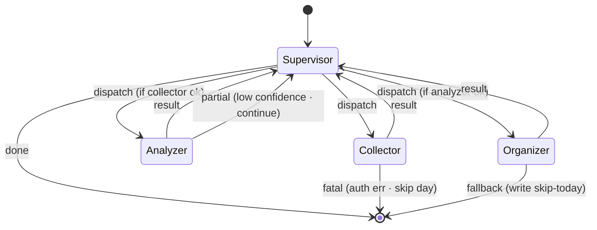

# spec · LangGraph state graph · 参考版 v1.0

> Week 3 · 第 10 节 · B 路产出
> BMAD Dev 画图 + grill-me 4 轮拷问 failure transition 后的终态

## 状态图

## 状态契约

### Collector

- **进入条件**：前一天 `.done` 文件存在（或 `--force`）
- **退出 ok**：`knowledge/raw/{date}.json` 写完 · schema 校验通过
- **退出 err**：
  - timeout 30s → 跳过当日（Analyzer / Organizer 全标 skip）
  - HTTP 5xx 3 次 → 跳过当日
  - auth 401/403 → 立即 fatal · 退出码 1

### Analyzer

- **进入条件**：`Collector.exit(ok)` 且 `raw/{date}.json` schema 合法
- **退出 ok**：`tagged.json` 写完 · 所有条目有 confidence
- **退出 partial**：LLM 返回格式错 · retry 1 次后标 `confidence=0` 继续（不阻塞）
- **退出 err**：全部 LLM 调用失败 → 跳过当日

### Organizer

- **进入条件**：`Analyzer.exit(ok)` 或 `Analyzer.exit(partial)`
- **退出 ok**：`articles/{date}.md` 写完
- **退出 fallback**：失败 retry 3 次仍失败 · 写兜底文案 `今日采集失败 · 请查 incidents/{date}.md`

### Supervisor

- **无状态**：不保存任何跨 worker 的中间态
- **失败恢复**：Supervisor 进程挂 · CI healthcheck 告警 · 人工重启
- **重启行为**：从头跑 · 靠 `.done` 文件跳过已完成 step

## Failure Transition 明细（grill-me 补出来的）

| 场景 | 当前状态 | 转移 | 副作用 |
|-----|---------|------|--------|
| Collector timeout 30s | Collector | 跳过当日 | `.collector.failed` + Analyzer/Organizer 标 skip |
| Analyzer 返回格式错 | Analyzer | retry 1 | 再错则 `confidence=0` 进入 partial |
| Organizer 写文件失败 | Organizer | retry 3 | 最终写兜底文案 |
| 三 worker 全失败 | Supervisor | `[*]` 退出码 1 | 写 `knowledge/incidents/{date}.md` |
| Supervisor 自己挂 | - | CI 层健康检查 | 告警 · 不在 graph 内 |

## 不做什么

- 不做 worker 之间直接通信（都经 Supervisor）
- 不做动态重路由（失败就按预设 transition · 不临时改图）
- 不持久化状态（Supervisor 无状态 · 重启从头）
